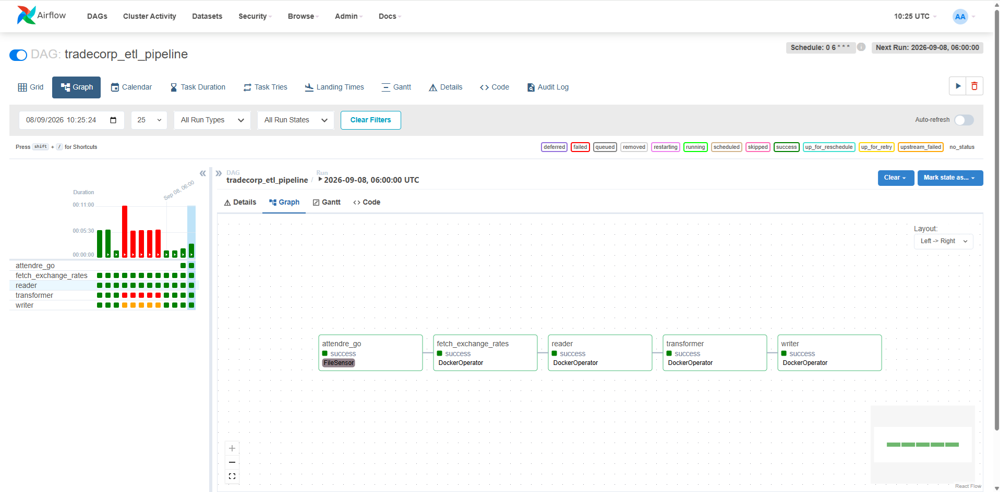
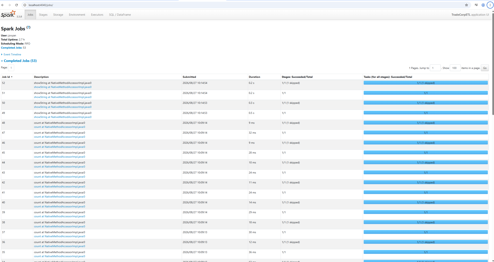
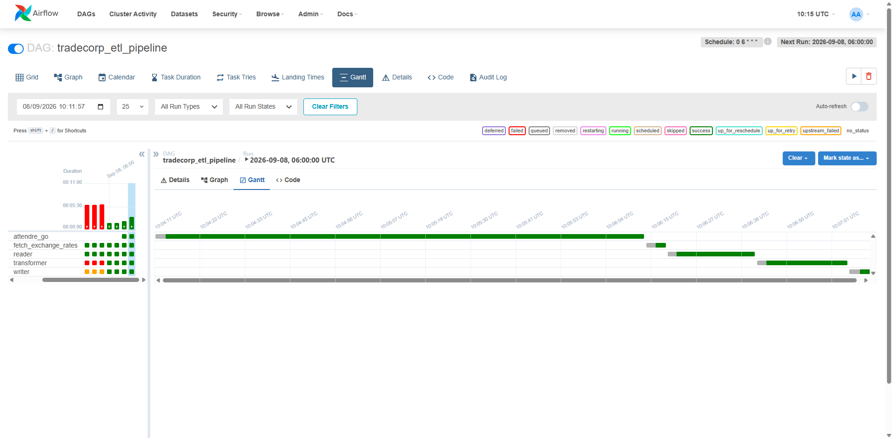
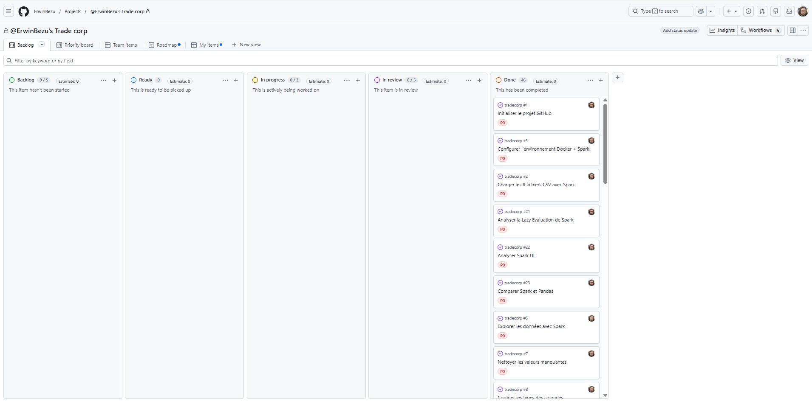
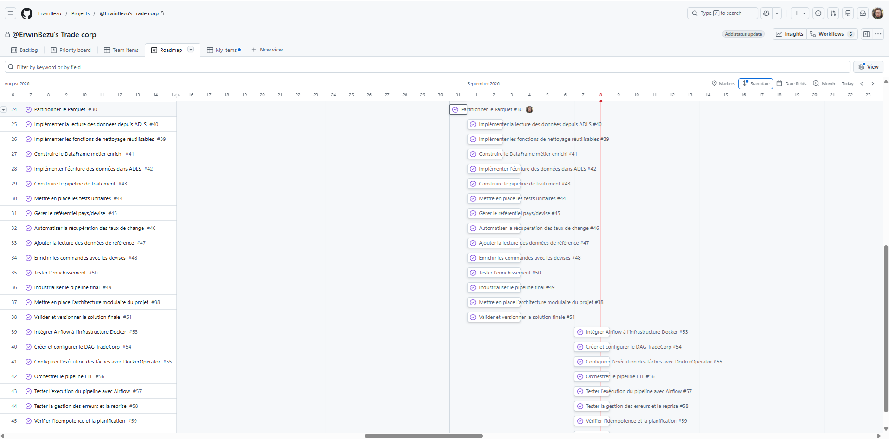
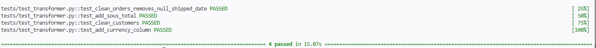
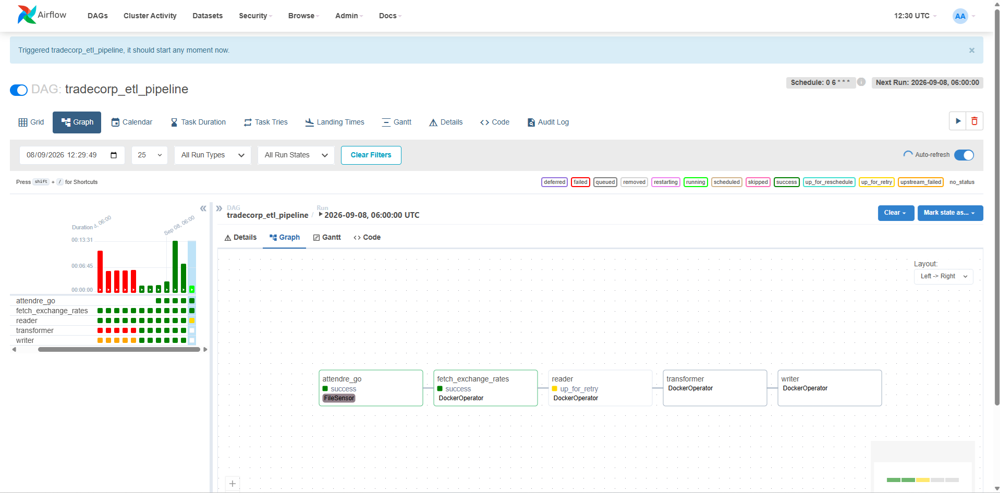
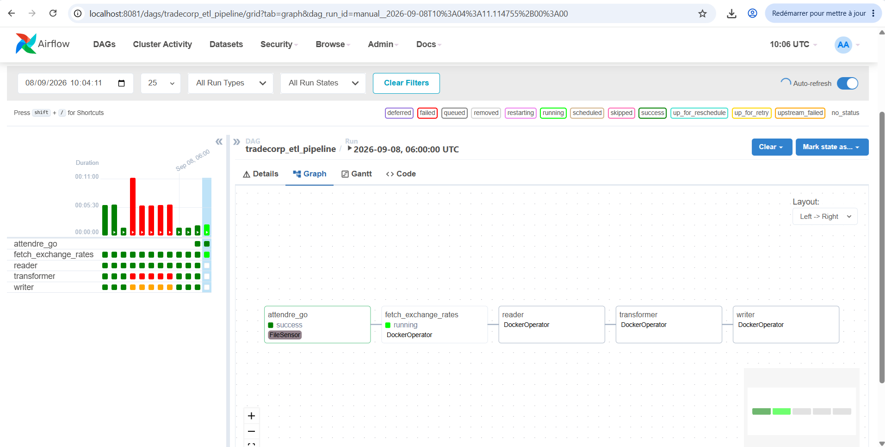

# Note de cadrage - Projet TradeCorp

## 1. Contexte du projet

TradeCorp souhaite mettre en place une solution permettant de centraliser, fiabiliser, transformer et exploiter des données provenant de plusieurs sources métier.

Les données sources présentent différentes problématiques de qualité : valeurs manquantes, doublons, formats hétérogènes et nécessité d'enrichir certaines informations. Le projet doit donc permettre de construire un pipeline de données capable d'automatiser ces traitements tout en assurant leur traçabilité et leur reproductibilité.

Le projet s'inscrit dans une démarche progressive allant de l'exploration des données jusqu'à l'industrialisation et l'orchestration du pipeline.

---

## 2. Problématique

**Comment concevoir un pipeline de données fiable, automatisé, maintenable et évolutif permettant d'ingérer plusieurs sources de données, de les nettoyer et de les enrichir avant leur mise à disposition dans un espace de stockage cloud ?**

La solution doit également permettre de superviser les traitements, de détecter les erreurs et de faciliter leur diagnostic.

---

## 3. Objectifs

L'objectif principal est de mettre en place un pipeline Data Engineering complet permettant de traiter automatiquement les données de TradeCorp.

Les objectifs opérationnels sont :

- Explorer les données afin d'identifier les problèmes de qualité.
- Automatiser leur lecture et leur ingestion.
- Nettoyer, normaliser et transformer les données avec PySpark.
- Enrichir les données, notamment à partir de données de référence et de taux de change.
- Conserver les données sources dans une zone `raw` et les résultats dans une zone `clean` sur Azure Blob Storage.
- Produire les données finales dans un format adapté aux traitements analytiques, notamment Parquet.
- Modulariser le pipeline afin de faciliter sa maintenance.
- Mettre en place des tests automatisés avec pytest.
- Journaliser les différentes étapes afin d'assurer la traçabilité des traitements.
- Conteneuriser l'environnement avec Docker.
- Automatiser et superviser le pipeline avec Apache Airflow.
- Suivre l'avancement, les coûts et les ressources du projet.

---

## 4. Périmètre fonctionnel

Le projet couvre l'ensemble du cycle de traitement des données, depuis leur récupération jusqu'à leur stockage après transformation.

Les données sources sont conservées dans la zone `raw` d'Azure Blob Storage. Elles sont récupérées puis traitées avec Apache Spark/PySpark.

Les traitements comprennent notamment :

- la gestion des valeurs manquantes ;
- la suppression des doublons ;
- la normalisation des chaînes de caractères ;
- la conversion des types ;
- la création de nouvelles informations utiles à l'analyse ;
- l'enrichissement des données à partir de données de référence et de taux de change.

Les données finales sont écrites au format Parquet dans la zone `clean` d'Azure Blob Storage.

Cette organisation permet de conserver les données originales et de rejouer les traitements si nécessaire.

---

## 5. Architecture technique

La solution repose sur les technologies principales suivantes :

| Composant | Rôle |
|---|---|
| **Python / PySpark** | Nettoyage, transformation et enrichissement des données |
| **Apache Spark** | Moteur de traitement distribué |
| **Azure Blob Storage** | Stockage cloud des données `raw` et `clean` |
| **Parquet** | Format de stockage des données transformées |
| **Docker** | Conteneurisation et reproductibilité de l'environnement |
| **Apache Airflow** | Orchestration et supervision du pipeline |
| **pytest** | Tests automatisés |
| **Git / GitHub** | Versionnement du projet |
| **GitHub Projects** | Suivi des tâches et de l'avancement |

Le pipeline est organisé en plusieurs modules Python à responsabilité distincte :

- `reader.py` : lecture et récupération des données ;
- `transformer.py` : nettoyage et transformation ;
- `enrichment.py` : enrichissement des données ;
- `writer.py` : écriture des données finales ;
- `pipeline.py` : coordination des traitements.

---

## 6. Architecture des données

Le stockage est séparé en deux zones principales dans Azure Blob Storage.

### Zone `raw`

La zone `raw` contient les données sources et les fichiers de référence dans leur état d'origine.

Leur conservation permet notamment de rejouer les traitements en cas de problème.

### Zone `clean`

La zone `clean` contient les données nettoyées, transformées et enrichies au format Parquet.

Le flux général peut être représenté de la manière suivante :

```text
Sources
   │
   ▼
Azure Blob Storage
   │
   └── raw
        │
        ▼
     PySpark
        │
        ├── Nettoyage
        ├── Transformation
        └── Enrichissement
        │
        ▼
Azure Blob Storage
   │
   └── clean / Parquet
```

---

## 7. Orchestration du pipeline

Apache Airflow assure l'automatisation et la supervision du pipeline.

Le DAG `tradecorp_etl_pipeline` est constitué de cinq tâches exécutées successivement :

```text
attendre_go
     │
     ▼
fetch_exchange_rates
     │
     ▼
reader
     │
     ▼
transformer
     │
     ▼
writer
```

La tâche `attendre_go` utilise un `FileSensor` afin de contrôler la présence d'un fichier déclencheur avant de poursuivre l'exécution.

Les étapes suivantes sont exécutées à l'aide de `DockerOperator`, permettant d'exécuter les différentes étapes du traitement dans des conteneurs Docker.

Le DAG est planifié quotidiennement à **6 h** avec `catchup=False`, afin de ne pas rejouer automatiquement les anciennes exécutions manquées.

---

## 8. Qualité et fiabilité

La qualité du pipeline est contrôlée à plusieurs niveaux.

Des tests automatisés avec pytest permettent de vérifier certaines règles de transformation et de limiter les risques de régression lors des évolutions du code.

Un système de logging permet également de suivre les différentes étapes d'exécution.

Apache Airflow apporte une couche supplémentaire de supervision en permettant de visualiser :

- l'état des tâches ;
- leur durée d'exécution ;
- leur ordre d'exécution ;
- les logs associés ;
- les éventuels échecs et reprises.

Un mécanisme de `retry` permet de relancer une tâche après un échec transitoire. Son fonctionnement a été vérifié avec le passage d'une tâche dans l'état `up_for_retry`.

---

## 9. Sécurité

Les informations sensibles nécessaires à la connexion aux services Azure sont externalisées dans des variables d'environnement et ne sont pas stockées directement dans le code source.

La séparation entre les zones `raw` et `clean` permet également de conserver les données sources indépendamment des données transformées.

Les principaux risques identifiés concernent :

- la perte ou la corruption des données ;
- les erreurs de transformation ;
- l'exposition des identifiants Azure ;
- l'échec d'une étape du pipeline ;
- l'indisponibilité d'un composant nécessaire à son exécution.

Les tests, les logs, la conservation des données brutes et les mécanismes de supervision d'Airflow permettent de limiter ces risques et de faciliter leur diagnostic.

---

## 10. Contraintes

Le projet doit respecter plusieurs contraintes techniques :

- utilisation de Spark/PySpark pour les traitements ;
- environnement conteneurisé avec Docker ;
- utilisation d'Azure Blob Storage pour le stockage cloud ;
- traitement des données en mode batch (traitement d'un ensemble de données par lots) ;
- conservation et sécurisation des données sources ;
- architecture modulaire facilitant les évolutions ;
- supervision des traitements ;
- traçabilité des erreurs.

Le projet ne met pas en œuvre de traitement en temps réel. Les données sont traitées par lots.

---

## 11. Méthodologie et organisation

Le projet est réalisé selon une démarche progressive et itérative organisée en plusieurs jalons.

Une première phase a permis de découvrir et de mettre en place l'environnement Docker.

Une phase d'exploration dans Jupyter Notebook a ensuite permis d'étudier les données et de déterminer les règles de nettoyage et de transformation.

Les traitements validés ont ensuite été industrialisés sous forme de modules Python distincts.

Les tests automatisés, le logging et le stockage Azure ont permis de fiabiliser progressivement le pipeline avant la mise en place de son orchestration avec Apache Airflow.

Git et GitHub sont utilisés pour le versionnement du projet.

GitHub Projects permet également de suivre les différentes tâches à travers un Kanban et une Roadmap.

---

## 12. Coûts et ressources

Les coûts liés à l'infrastructure cloud sont estimés avec Azure Pricing Calculator.

Une hypothèse de **100 Go de stockage** a été utilisée afin d'obtenir un ordre de grandeur du coût de stockage mensuel.

L'estimation réalisée aboutit à environ **1,76 € par mois** pour le stockage considéré.

Le choix du format Parquet contribue également à limiter le volume de stockage et les quantités de données lues par rapport à l'utilisation systématique de fichiers CSV.

Les ressources de traitement peuvent être observées avec la Spark UI, tandis qu'Airflow permet de suivre l'état et la durée des différentes tâches du pipeline.

---

## 13. Livrables

Les principaux livrables du projet sont :

- les notebooks d'exploration et de transformation ;
- le code source du pipeline ;
- les modules Python ;
- les fichiers de configuration Docker ;
- le `docker-compose.yml` ;
- le DAG Apache Airflow ;
- les tests automatisés avec pytest ;
- la documentation `README.md` ;
- les données finales au format Parquet ;
- les captures d'écran permettant de valider et documenter le fonctionnement de la solution.

---

## 14. Critères de réussite

Le projet est considéré comme fonctionnel lorsque :

- les données sources peuvent être récupérées depuis Azure Blob Storage ;
- les données peuvent être nettoyées et transformées avec PySpark ;
- les données peuvent être enrichies avec les données de référence ;
- les données finales sont écrites dans la zone `clean` au format Parquet ;
- les principales transformations sont vérifiées par des tests automatisés ;
- le pipeline peut être exécuté automatiquement avec Apache Airflow ;
- les dépendances entre les différentes tâches sont respectées ;
- le déclenchement avec le `FileSensor` fonctionne correctement ;
- les erreurs et les reprises peuvent être supervisées dans Airflow ;
- les logs permettent de suivre et diagnostiquer les différentes étapes du traitement.

La réussite du projet repose ainsi sur la mise en place d'un pipeline **fonctionnel, reproductible, automatisé, supervisé et maintenable**.

---
# RAPPORT
---

# C1. Développer un dispositif de veille

Dans le cadre de ce brief, plusieurs veilles ont été réalisées en groupe, notamment sur Docker, Spark et sur Airflow. 

Pour chaque sujet de veille, nous avons commencé par une recherche individuel des informations provenant de différentes sources, principalement des documentations officielles et des ressources techniques spécialisées obtenues grâce au moteur de recherche. 

Les informations recueillies ont ensuite été confrontées et croisées afin de vérifier leur cohérence et leur fiabilité. Cette étape nous a permis de sélectionner les informations les plus pertinentes.

À partir de cette sélection, nous avons réalisé un travail de synthèse et de vulgarisation afin de rendre les notions techniques compréhensibles. Les informations retenues ont ensuite été structurées dans un support de présentation.

La diffusion de la veille a été réalisée lors d'une présentation orale devant la promotion. Cette présentation permettait également un moment d'échange.

Enfin, les supports de présentation sont conservés afin de garder une trace des recherches effectuées et de pouvoir réutiliser ultérieurement les informations collectées.

Le processus de veille suivi peut ainsi être résumé de la manière suivante :

Recherche et collecte => croisement et analyse des sources => synthèse et vulgarisation => création du support => présentation à la promotion => conservation du support.


**Évaluation** : 
- Le process de veille détaille clairement les étapes de collecte, d’exploitation, diffusion et conservation de l’information.
- Les sources d’information (stratégique, concurrentielle, règlementaire, sectorielle, …) permettent de recueillir des informations alimentant le diagnostic stratégique de l’entreprise.

---

# C3. Identifier les attentes et besoins utilisateurs et contraintes du client final et de la DSI2

À partir du postulat fourni dans le brief, les besoins du projet ont été identifiés autour de la mise en place d'un pipeline de données permettant de charger, contrôler, nettoyer, transformer et enrichir plusieurs sources de données. Les données sources sont stockées dans Azure Blob Storage et traitées avec Apache Spark avant leur écriture au format Parquet. Le pipeline doit également pouvoir être automatisé et supervisé avec Apache Airflow. Les principales contraintes concernent l'utilisation de PySpark, l'exécution dans un environnement Dockerisé, la qualité et la cohérence des données, la sécurisation des accès ainsi que la traçabilité des traitements.

Le projet ne comportant pas d'interface utilisateur destinée au grand public, les problématiques d'accessibilité concernent principalement la documentation, les notebooks et les supports de restitution. Ceux-ci doivent rester lisibles et structurés.

**Évaluation** :
- La demande est clarifiée au travers de formulations justes faisant ressortir les attentes et contraintes du client. - Les processus métier et exigences clients sont formalisées. - Les situations de handicap dans lesquelles les utilisateurs pourraient se retrouver sont recherchées et considérées

---

# C5. Diagnostiquer la problématique, via une étude contextualisée de l’environnement interne et externe du client

L’analyse du contexte met en évidence la nécessité pour TradeCorp de disposer de données fiables et exploitables provenant de plusieurs sources. L’utilisation de fichiers séparés implique des problématiques de qualité, de cohérence et de traitement des données. La mise en place d’un pipeline avec Apache Spark permet d’automatiser les opérations de nettoyage, de transformation et d’enrichissement tout en proposant une architecture capable d’évoluer avec l’augmentation du volume de données grâce au traitement distribué. La conteneurisation avec Docker facilite également le déploiement et la reproductibilité de l’environnement. Les principales contraintes identifiées concernent les ressources nécessaires à Spark, la sécurisation des accès et des données, ainsi que la complexité supplémentaire apportée par une architecture distribuée par rapport à un traitement classique.

**Évaluation** : 
- Le diagnostic met en relation des éléments liés à son environnement interne et externe et permet de délimiter nettement une problématique ainsi qu’un niveau de solution à apporter. - Les contraintes opérationnelles, telles que la scalabilité, la performance et la sécurité, sont prises en compte dans l'analyse.
- Les opportunités dégagées répondent spécifiquement au contexte du client. Elles sont à la fois ambitieuses et atteignables (cela peut inclure l'adoption de nouvelles technologies, l'optimisation des processus, ou la réorganisation de l'architecture pour mieux répondre aux besoins stratégiques).
- Les obstacles et contraintes sont estimés dans leurs dimensions techniques et organisationnelles.

---

# C6. Définir une stratégie data et/ou IA et un plan d’action adaptés aux enjeux du client

La stratégie retenue repose sur une séparation en zones Azure Blob Storage (`raw`/`clean`), permettant de conserver les données brutes et de garantir la traçabilité des traitements avant mise à disposition des données enrichies. Les interventions ont été hiérarchisées selon le risque: fiabilisation des données par le nettoyage, enrichissement des données avec les taux de change, puis automatisation avec Apache Airflow. L'organisation modulaire du pipeline facilite l'évolution indépendante des différentes étapes(`reader`, `transformer`, `enrichment`, `writer`) et limite l'impact d'une modification sur le reste du traitement. L'automatisation est assurée par un DAG Airflow composé de cinq tâches successives : `attendre_go`, `fetch_exchange_rates`, `reader`, `transformer` et `writer`. Un `FileSensor` contrôle la présence du fichier déclencheur avant le lancement des traitements, puis les différentes étapes sont exécutées à l'aide de `DockerOperator`.
Les accès à Azure Blob Storage sont sécurisés via des identifiants stockés hors du code source dans des variables d'environnement.

**Évaluation** :
- La stratégie de sécurisation de l'architecture des données est alignée sur la stratégie générale de l'entreprise ainsi que sur les besoins spécifiques des utilisateurs d'assurer que les structures de données et les modèles de données soutiennent efficacement les objectifs business et opérationnels. Une stratégie spécifique pour l'intégration de l'intelligence artificielle dans l'architecture des systèmes d'information est élaborée. Elle vise à maximiser l'exploitation des données pour générer des insights précis
.- Les interventions sur l'architecture des données sont hiérarchisées, en utilisant une approche fondée sur une évaluation rigoureuse des risques associés aux différentes composantes des systèmes d'information. - Le plan d’actions est conçu pour être robuste et précis, tout en étant suffisamment flexible pour s'adapter aux changements dans l'environnement technologique et opérationnel de l'organisation. Ce plan doit intégrer des mesures préventives et correctives pour renforcer la sécurité des données. - Les objectifs de sécurité des données - intégrité, disponibilité et confidentialité - sont définis en tenant compte du cadre réglementaire applicable et des besoins précis du client pour que l'architecture de données soit conforme et sécurisée. - Les solutions de mitigation sont mises en oeuvre en collaboration avec les équipes IT et de sécurité, en respectant les délais et les budgets prévus. - Les recommandations fournies permettent aux équipes opérationnelles de se positionner par rapport aux niveaux de service attendus en termes de disponibilité, intégrité et confidentialité des systèmes d'information, avec une attention particulière sur l'architecture des données et son évolution.

---

# C7. Déployer une approche Green IT et Low-tech,
Le format Parquet réduit significativement le volume de stockage par rapport aux CSV bruts, limitant l'empreinte de stockage sur Azure Blob Storage. La conteneurisation Docker permet de disposer d'un environnement reproductible et homogène, en évitant la multiplication de configuration logicielles différentes entre les postes de travail. Le pipeline ne télécharge que les fichiers strictement nécessaires (huit CSV métier et deux fichiers référence), évitant tout traitement superflu de données non utilisées.

**Évaluation** :
- L’utilisation des ressources est minimisée et inclut la réduction de l'empreinte carbone des infrastructures IT, l'optimisation de l'efficacité énergétique des systèmes, et la mise en place de solutions low-tech.
- Les valeurs clés de la RSE sont intégrées en prenant notamment appui sur les objectifs de développement durable de l’ONU.
- Des normes sur l’écoconception des services numériques sont introduites dans le projet de sécurité informatique.

---

# C8. Présenter la solution informatique proposée
La solution est présentée de manière à être compréhensible par un public technique, en explicitant les technologies utilisées (Spark/PySpark, Docker, Azure Blob Storage, Parquet et Apache Airflow) ainsi que l’architecture modulaire du pipeline. Le pipeline est orchestré par un DAG Airflow composé de cinq tâches :

`attendre_go → fetch_exchange_rates → reader → transformer → writer`

La première tâche utilise un `FileSensor` afin d'attendre la présence d'un fichier déclencheur. Les quatre étapes suivantes utilisent des `DockerOperator`.

L'interface Airflow permet de visualiser l'enchaînement des tâches, leur état et les logs associés à chaque exécution.



Le logging, les tests automatisés avec pytest et les différentes interfaces de supervision permettent de vérifier le bon fonctionnement de la solution.

**Évaluation** : 
- Le vocabulaire est choisi en fonction de l’environnement stratégique et opérationnel du client.
- Les gains en termes de performance et de sécurité sont clairement démontrés après l'optimisation de l’architecture.
- Le support pour la présentation orale est à la fois lisible, complet, synthétique et adapté à la cible ainsi qu’aux enjeux de la situation de présentation de la solution.

---

# C10. Rédiger les spécifications techniques, à partir des besoins identifiés
- **Technologies** : PySpark, Docker, Azure Blob Storage, Parquet, pytest et Apache Airflow.
- **Stockage** : zone *raw* (CSV bruts et fichiers de référence), zone *clean* (Parquet enrichi).
- **Architecture** : modules à responsabilité unique (`reader.py`, `transformer.py`, `enrichment.py`, `writer.py`, `pipeline.py`).
- **Orchestration** : DAG Airflow composé de cinq tâches (`attendre_go`, `fetch_exchange_rates`, `reader`, `transformer`, `writer`).
- **Déclenchement** : utilisation d'un `FileSensor` pour contrôler la présence du fichier déclencheur.
- **Exécution** : utilisation de `DockerOperator` pour les différentes étapes du traitement.
- **Planification** : exécution quotidienne à 6h avec `catchup=False`.
- **Sécurité** : pas de clés en clair, séparation raw/clean.
- **Maintenance**: les tests pytest garantissent la non-régression à chaque évolution du code.
- **Évolutivité** : l'architecture modulaire permet d'ajouter ou de modifier une étape du pipeline sans réécrire l'ensemble du traitement.

**Évaluation** : 
L'expression des besoins data et IA est cohérente :
- Par rapport au type de structure de l'entreprise,
- En conformité avec les exigences légales et réglementaires,
- En tenant compte de la nature et du contexte spécifique du projet, notamment en ce qui concerne les données à caractère personnel (DCP),
- En alignement avec le contexte métier de l’entreprise et son évolution,
- En prenant en considération les menaces techniques, humaines et organisationnelles,
- En intégrant les nouveaux événements majeurs dans les domaines juridique, économique, politique, commercial, technologique, ou environnemental. 
- Les spécifications techniques pour la gestion des données incluent les éléments suivants : choix des technologies de données ; stratégies de stockage et options d'hébergement des données ; configuration de l'environnement et architecture des systèmes de données ; exigences de programmation spécifiques pour la manipulation des données ; normes d'accessibilité et de récupération des données ; protocoles de sécurité pour la protection des données ; maintenance des systèmes de données et stratégies pour les évolutions futures ; glossaire des termes techniques liés à la gestion des données.

---

# C11. Assurer la conception méthodologique d’un projet en ingénierie de données massives

Le projet est organisé selon une démarche progressive et itérative (en plusieurs jalons). Le premier concernait la découverte de Docker, de Dockerfile et du docker-compose. La seconde phase d'exploration sous forme de notebooks a permis d'analyser les données sources, d'identifier les problèmes de qualité et de valider les règles de nettoyage et de transformation. Ces traitements ont ensuite été industrialisés sous forme de modules Python distincts (`reader.py`, `transformer.py`, `enrichment.py`, `writer.py` et `pipeline.py`), afin de séparer les responsabilités et de faciliter leur maintenance. 

La fiabilité du pipeline est contrôlée par des tests automatisés avec pytest, des contrôles sur les schémas et les données produites ainsi que par un système de logging permettant de suivre chaque étape de l'exécution. Les données brutes sont conservées dans la zone `raw` d'Azure Blob Storage tandis que les données nettoyées et enrichies sont écrites dans la zone `clean`, ce qui permet de reprendre les traitements depuis les sources en cas d'échec. 

La dernière phase du projet a consisté à automatiser le pipeline avec Apache Airflow. Les différentes étapes ont été intégrées dans un DAG afin de contrôler leur ordre d'exécution et leur état.
Un `FileSensor` contrôle la présence du fichier déclencheur avant le lancement des traitements, puis les différentes étapes sont exécutées successivement à l'aide de `DockerOperator`.
Cette organisation permet de passer d'une exécution manuelle du pipeline à un workflow automatisé et supervisé. La méthodologie retenue permet ainsi de faire évoluer progressivement la solution tout en conservant des étapes de validation entre l'exploration, l'industrialisation, les tests et l'orchestration.

**Évaluation** :
- Le choix de la méthode de gestion informatique (type agile, en V, en cascade, hybride) est argumenté et cohérent au regard de l’analyse des besoins et moyens associés. 
- La démarche de pilotage de projet repose sur l’utilisation de bonnes pratiques numériques notamment issues du ‘Guide des bonnes pratiques numérique responsable pour les organisations’ élaboré par la Mission interministérielle numérique écoresponsable3. 
- Les impacts environnementaux et sociaux sont pris en compte dans la sélection des méthodes relatives au projet informatique. 
- Une politique d’archivage, d’expiration et de suppression des données est définie conformément aux directives de la CNIL. 
- Le cadre de référence légal et règlementaire associé au projet est exhaustif.

---

# C13. Décrire la solution informatique et ses fonctionnalités (user stories)

Documentation produite : README.md (installation, lancement et orchestration), docstrings dans les modules Python, notebooks commentés, documentation du DAG Airflow et captures d'écran de validation (pytest, Spark UI, Graph Airflow, Gantt, FileSensor et mécanisme de retry).

**Évaluation** :
- Une documentation est fournie pour chaque étape du projet : Cahier des Charges Fonctionnel, Document d’Architecture Technique, Documentation du code, Guide d’installation, Manuel utilisateur…

---

# C14. Contrôler et mesurer l’avancement du projet Data
L’avancement du projet est contrôlé à l’aide de plusieurs indicateurs. Le respect des échéances et des différents jalons permet de suivre les délais. Les coûts de l’infrastructure cloud ont été estimés avec Azure Pricing Calculator : pour une hypothèse de 100 Go de stockage, le coût mensuel du stockage est estimé à environ 1,76 € par mois. Les ressources de traitement peuvent être observées à travers la Spark UI afin de suivre l’exécution des jobs, stages et tâches Spark.



Apache Airflow complète cette supervision en permettant de suivre l’état et la durée des différentes tâches du pipeline. La vue Gantt permet notamment d’observer leur temps d’exécution et leur enchaînement.



L’avancement du projet est également suivi à l’aide de GitHub Projects. Le Kanban permet de visualiser les tâches prévues, en cours et terminées, tandis que la Roadmap permet de suivre leur répartition dans le temps.





La qualité est vérifiée tout au long du projet par les tests automatisés avec pytest, le contrôle des schémas et des données produites ainsi que par l’exécution complète du pipeline. 



Ces vérifications permettent de contrôler la conformité de l’analyse aux spécifications du brief, de la conception aux besoins identifiés et du résultat final au cahier des charges.

Le suivi prend également en compte des critères ESG, notamment par l’utilisation du format Parquet, qui limite le volume de stockage et optimise les lectures, ainsi que par la limitation des traitements aux données nécessaires.

Enfin, le projet s’appuie sur les objectifs et les étapes définis dans le brief (approche causale), tout en adaptant progressivement la solution aux contraintes techniques rencontrées et aux résultats obtenus (approche effectuale).

**Évaluation** : 
- Les indicateurs choisis comprennent à minima des KPI de coût, délai et de ressources ainsi que des critères ESG5 - Les indicateurs choisis répondent aux exigences des approches causale ainsi qu’ effectuale. 
- La garantie de la qualité est permise par la vérification de la conformité aux exigences convenues :
   - Celle de l’analyse pour la conformité aux spécifications de la demande,
   - Celle de la conception pour la conformité aux besoins du client,
   - Celle du produit final pour la conformité au cahier des charges établi en amont.

---

# C15. Estimer et suivre les coûts tout au long du cycle de vie du projet de développement informatique

Les coûts liés à l’infrastructure cloud ont été estimés à l’aide de l’Azure Pricing Calculator. Une estimation a été réalisée pour le stockage des données sur Azure, sur la base d’une volumétrie prévisionnelle de 100 Go, afin d’obtenir un ordre de grandeur du coût mensuel de la solution.

Cette estimation permet d’anticiper l’évolution des coûts en fonction de la volumétrie des données et de leur utilisation. Le choix du format Parquet, plus compact que le CSV et optimisé pour les traitements analytiques, contribue également à limiter les besoins en stockage et les volumes de données lus.

Le coût peut être réévalué au cours du projet en ajustant dans Azure Pricing Calculator la volumétrie, les opérations de lecture et d’écriture ou les ressources de calcul nécessaires. Cette démarche permet de comparer les besoins réels aux hypothèses initiales et d’adapter l’infrastructure si nécessaire.

**Évaluation** : 
- Le budget est aligné sur les objectifs du projet tout en anticipant les éventuelles adaptations. 
- Le budget du projet est correctement analysé et fait éventuellement l’objet de préconisations par le candidat. - Les coûts de déploiement et d’exploitation de chaque étape du cycle de vie de la solution ou de l’équipement sont correctement dimensionnés.
- Les actions liées à l’environnement sont budgétées.y

---

# C21. Evaluer tous les risques potentiels associés à la manipulation de grandes quantités de données

Les principaux risques identifiés concernent la perte ou la corruption des données pendant les traitements, les erreurs de transformation, l'exposition des identifiants Azure et l'échec d'une étape du pipeline. Ils sont limités par la conservation des données brutes dans la zone raw, l'utilisation de variables d'environnement pour les secrets, les tests automatisés et la journalisation des différentes étapes du pipeline.

L'orchestration introduit également des risques liés à l'échec d'une tâche ou à l'indisponibilité d'un composant nécessaire à l'exécution.

Les dépendances du DAG empêchent les tâches suivantes de poursuivre le traitement lorsqu'une étape précédente échoue. Airflow fournit également des mécanismes de retry permettant de relancer automatiquement une tâche après un échec transitoire.

Le mécanisme de reprise a été testé en provoquant volontairement une erreur. La tâche concernée passe alors dans l'état `up_for_retry` avant une nouvelle tentative.



**Évaluation** : 
- L’évaluation des risques porte sur la sécurité, la sauvegarde, la récupération ainsi que le traitement des données.
- L'identification des risques prend en compte les aspects réglementaires, comme le respect des normes de confidentialité et de protection des données (RGPD, etc.).

---

# C25. Concevoir et administrer des data lakes et data warehouses

Le stockage Azure Blob Storage est structuré en deux zones : `raw`, destinée à conserver les données sources, et `clean`, destinée aux données nettoyées et enrichies au format Parquet. Le pipeline PySpark assure la lecture des données depuis la zone `raw` et l’écriture des données transformées dans la zone `clean`. Cette organisation permet de conserver les données d’origine et de reprendre les traitements en cas de besoin.

**Évaluation** : 
- Les infrastructures basées sur Hadoop ou MongoDB sont conçues pour être facilement évolutives, permettant d'ajouter de nouvelles sources de données et d'augmenter les capacités de traitement sans compromettre les performances ou la stabilité. 
- L’utilisation d’Hadoop et MongoDB facilitent l'intégration des données provenant de diverses sources et leur utilisation pour des analyses avancées. 
- RDF et OWL sont utilisés de manière appropriée pour structurer les données, en créant des modèles sémantiques clairs et interopérables qui facilitent l'intégration et l'analyse des données.
- Les systèmes d'ontologies permettent l'extraction de connaissances pertinentes à partir de données non structurées et semi-structurées. 
- Les standards de l'industrie pour la modélisation sémantique garantissent une interopérabilité maximale avec d'autres systèmes et applications basées sur la sémantique.

---

# C26. Gérer la scalabilité et la performance des architectures de stockage,

L’utilisation de Spark permet de traiter les données de manière distribuée et de conserver une architecture capable de monter en charge lorsque la volumétrie augmente. Le stockage des données nettoyées au format Parquet, colonnaire et compressé, permet de limiter les données lues lors des traitements et d’améliorer les performances. Les transformations et les tests automatisés permettent également de vérifier la fiabilité et l’intégrité des données produites.

**Évaluation** : 
- Les requêtes sont exécutées plus rapidement sur de grands volumes de données, minimisent les erreurs et assurent l'intégrité des données. 
- Les requêtes optimisées maintiennent des performances élevées à mesure que le volume de données augmente. 
- Les données sont traitées de manière plus fiable après optimisation.

---

# C28. Mettre en œuvre des pipelines de données sécurisés
Le pipeline garantit une exécution fiable grâce à une gestion structurée des erreurs, aux tests automatisés et à la journalisation des différentes étapes.

Les identifiants nécessaires à la connexion à Azure Blob Storage sont externalisés dans des variables d'environnement afin de ne pas exposer les secrets dans le code source.

Le traitement reste en mode batch (traitement automatique d'un ensemble de données à heure fixe) mais est désormais automatisé et supervisé par Apache Airflow. Le `FileSensor` contrôle la présence du fichier nécessaire au déclenchement du pipeline et les dépendances du DAG garantissent l'exécution des tâches dans l'ordre prévu.

Un mécanisme de retry permet également de relancer une tâche après un échec transitoire. Les logs Airflow permettent d'identifier l'étape concernée et de faciliter le diagnostic.

**Évaluation** : 
- Les pipelines de données garantissent une transmission cohérente et fiable des données critiques, en limitant les pertes de données et en maintenant la continuité des flux même en cas d'incidents. 
- Les données sont traitées et disponibles en temps réel. - Les pipelines de données sont sécurisés grâce à des techniques appropriées, telles que : le chiffrement, les contrôles d'accès, etc.

---

# C30. Déployer et optimiser des infrastructures sur Amazon AWS, Google Cloud ou Azure

Azure Blob Storage est utilisé comme solution de stockage cloud pour les données brutes et transformées, organisées en zones `raw` et `clean`. Le format Parquet permet d’optimiser le stockage et les lectures. Le dimensionnement et le coût des ressources Azure ont été estimés avec Azure Pricing Calculator afin d’anticiper l’évolution de la volumétrie et de maîtriser les coûts.

**Évaluation** : 
- Les solutions cloud déployées sont capables de s'adapter dynamiquement aux variations de la demande, optimisent l'allocation des ressources et garantissent une disponibilité continue et une performance élevée, même lors des pics de charge. 
- Les clusters de calcul sont configurés pour maximiser la puissance de traitement et permettent des calculs intensifs sans compromettre la réactivité des applications. 
- Le stockage distribué est géré de manière efficace : il assure une accessibilité rapide aux données tout en minimisant les coûts liés à la consommation de ressources. 
- Les systèmes mis en place démontrent une capacité à évoluer facilement, supportant une augmentation du volume de données et des utilisateurs sans dégradation des performances.

---

# C31. Concevoir et optimiser des pipelines de données dans le cloud

Le pipeline automatise l'ingestion des données depuis le conteneur `raw` d'Azure Blob Storage, leur transformation avec Spark, puis leur écriture au format Parquet dans le conteneur `clean`.

Son architecture modulaire sépare les différentes étapes du traitement et facilite leur maintenance.

Le pipeline est désormais orchestré avec Apache Airflow selon l'enchaînement suivant :

`attendre_go → fetch_exchange_rates → reader → transformer → writer`

La tâche `attendre_go` utilise un `FileSensor` afin de contrôler la présence du fichier déclencheur. Les étapes suivantes sont exécutées à l'aide de `DockerOperator`.

Lorsque le fichier est absent, le `FileSensor` maintient le pipeline en attente :


Lorsque le fichier est détecté, le pipeline poursuit automatiquement son exécution :



Airflow permet ainsi d'automatiser l'enchaînement des traitements, de superviser leur exécution et de centraliser les informations nécessaires au diagnostic en cas d'échec.

**Évaluation** : 
- Les pipelines de données sont conçus pour automatiser efficacement l'ingestion, la transformation, et la distribution des données, garantissent une exécution fluide et sans interruption des processus de bout en bout. 
- La rapidité et la fiabilité des flux de données sont maintenues même sous des charges de travail élevées.
- Les outils tels que AWS Data Pipeline et Azure Data Factory sont utilisés de manière optimale, permettant une gestion flexible et évolutive des pipelines pour répondre aux besoins croissants de l'entreprise.

---

# C34. Assurer le nettoyage, la transformation et la réduction de la dimensionnalité des datasets

Les fonctions de `transformer.py` (`clean_customers`, `clean_orders`, `clean_order_details`, `clean_employees`, `clean_products`) assurent le nettoyage et la transformation des données : suppression des doublons et valeurs manquantes, normalisation des chaînes de caractères et conversion des types (dates, prix, quantités). Les colonnes inutiles sont écartées afin de ne conserver que les données nécessaires à la construction du dataset enrichi.

**Évaluation** : 
- Le nettoyage et la transformation des données sont effectués avec précision : éliminent les anomalies, les valeurs manquantes et les incohérences, ce qui améliore la qualité des données et la fiabilité des analyses. 
- Les techniques de réduction de la dimensionnalité sont appliquées efficacement, optimisant les performances des modèles d'IA en réduisant la complexité des datasets sans perdre d'information critique.

---

# C39. Effectuer l’analyse exploratoire des données

L’analyse exploratoire a été réalisée dans Jupyter Notebook avec PySpark. Elle comprend l’analyse des schémas des différents datasets, le comptage des valeurs nulles et l’étude de statistiques descriptives (`min`, `max`, `mean`, `stddev`) afin d’identifier les caractéristiques et les problèmes de qualité des données. Cette exploration a permis de définir les règles de nettoyage et de transformation appliquées ensuite dans le pipeline.

**Évaluation** : 
- L’analyse exploratoire des données est réalisée avec précision à l’aide d’outils tels que Jupyter Notebook et RStudio, Les résultats de l’analyse sont interprétés de manière pertinente, offrant une compréhension approfondie des données et facilitant l’élaboration de modèles prédictifs robustes.